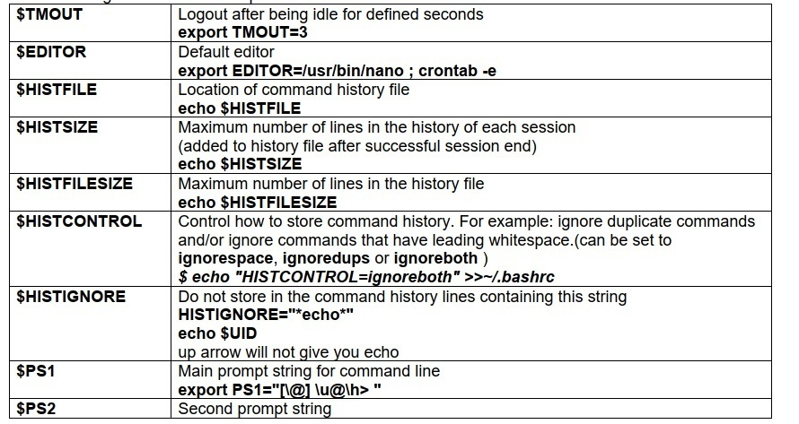
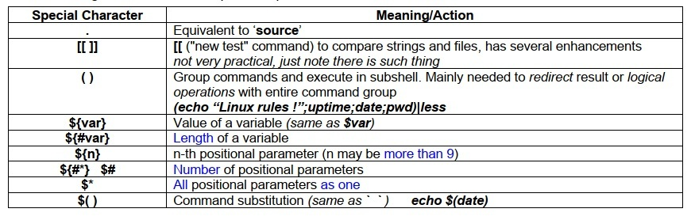

# Shell programming in Linux


Some important variables


## Midnight Commander

Midnight Commander - visual file manager


```bash
sudo apt install mc
```


* TAB          տեղափոխվել պանելների միջև 
* Esc Enter         տանել ընտրված ֆայլի անունը հրամանի տող 
* Esc A 	    տանել ընտրված ֆայլի ճանապարհը հրամանի տող 
* Esc H 	    հրամանի տողի պատմություն 
* Esc P 	    նախորդ հրաման 
* Ctrl  O            թաքցնել/ցույց տալ պանելները 
* Esc 9 -> File -> Chmod 
* Esc 9 -> File -> Advanced Chown
* F10 = Esc 0 = exit      ելք 


## File Permissions


<br><br>

<br><br>

<br><br>

<br><br>

<br><br>

<br><br>


<br><br>


##  Advanced BASH Shell Scripting


### Here Documents 

_Here document_ is useful advanced Bash scripting technique, 
that allows to specify multiple lines of input for a command. 

It can be used to specify long blocks of text or script code as input to some command.

By using _here documents_ we can automate various tasks.

_Here documents_ are specified using **<<** operator, 
followed by a some **delimiter**, which can be any _unique_ string.

The end of _here documents_ is specified by repeating the **delimiter** on the line without anything else.
Because of that the **delimiter** should be unique string.

In examples below "EOF1" delimiter string is used, but it can be other as well.

> **Important note:**
> 
> As you may notice in examples below **EOF1** delimiter is double quoted,
> which is not required for all cases, but enables protection for
> _special characters_ ( like `$` ) not to be interpreted by bash, so the whole text block
> is being delivered to the command as-is.


#### How we use _here documents_ below

We start with here document, since all below examples of script code 
use this technique for giving input to ` cat ` command to create some file 
containing particular script.

After that we also add **chmod** command to make script executable.

After several below examples you will quickly get the idea of _here document_ usage.

*Quick initial script example*

```bash
cat  > ~/ex1.sh  << "EOF1"

#!/bin/bash

if [ -z ${1} ]; then
echo "Usage: $0 <number>"
exit
fi

if [ $1 -eq $1 2>/dev/null ]
then
        echo "How do you like it:"
                for (( i=1; i<=${1}; i++ ))
                do
                        for (( j=1; j<=i;  j++ ))
                        do
                        echo -n "$i"
                        done
                        echo ""
                done
else
 echo "$1 is not a number"
 exit
fi

EOF1
chmod +x ~/ex1.sh

```

### Variables
Bash variables - temporary storage for information
Bash does not care about the type of variables. 
Variables could store strings, characters or integers. 

Variable names are uppercase by convention, but lowercase and other symbols can be used as well.

Syntax: **VARNAME=VALUE**

Note: There should be no space around “=” sign 

The following script creates a variable called LIST and assigns the value “/usr/bin”. 
Prefix the variable name with $, which will give the value stored in that variable.

#### PRACTICE

*Example.1 Simple Bash Variable Assignment Usage*

```bash
cat  > ~/sample.sh  << "EOF1"
#!/bin/bash
LIST="/usr/bin/"
ls -l $LIST
EOF1
chmod +x ~/sample.sh

```

Execute the above script, which will list the /usr/bin in long format.

**Task: Modify the script to work with 1-st positional parameter.**

#### Bash Variable Scope – Local and Global 

In Bash, variables do not have to be declared. When you access the variable which is not used so far, 
you will not get any warning or error message. Instead, it will display a blank value. 

*Example 2. Blank values in bash variables* 


```bash
cat > ~/var1.sh << "EOF1"
#!/bin/bash 
echo "Variable value is: $VAR1" 
VAR1="LINUX" 
echo "Variable value is: $VAR1" 
EOF1
chmod +x ~/var1.sh

```

Initially the variable will have a blank value, after assigning, you can get your values.  
export command is used to export a variables from an interactive shell.  
export shows the effect on the scope of variables. 

`VAR1=UNIX ; ./var1.sh`

 
Still you will get blank value for variable VAR1. The shell stores variable VAR1 with the LINUX only in 
the current shell. During the execution of var1.sh, it spawns the subshell and it executes the script. So 
the variable VAR1 will not have the value in the spawned shell.  
You need to export the variable for it to be inherited by another program – including a shell script, as 
shown below. 

`export VAR1=UNIX ; ./var1.sh `

Now, you can notice that after execution of the shell script var1.sh, the value of VAR1 is UNIX. Because 
the variables will not be passed back to your interactive shell, unless you execute the script in the 
current shell 


**Global variables** (also called **environment variables**) - available to all shells. 
The `env` or `printenv` commands can be used to display environment variables. 

**Local variables** are visible only within the block of code.  
Using the `set` built-in command without any options will display a list of all variables 
(including environment variables) and functions.  

In a function, a local variable has meaning only within that function block. 

`$ set | grep HIST` 

The following table lists some important Bash internal variables that can be redefined:  




#### Special Characters 
The following table lists some important special characters:  



### Functions

Functions in Bash allow us to easily re-use code making the code easier to manage and read. 
When your scripts are getting a little more complex it’s good to spend a little bit of time thinking about
how you structure them and if there are repeating tasks - make them a function 

Functions are called simply by invoking their names.  

_A function call is equivalent to a command._ 

The function definition must precede the first call to it.


Bash function syntax variants: 
>
> function_name () {
> 
> commands... 
> 
> } 
>

or

>
> function function_name { 
> 
> commands... 
> 
> } 


Most other programming languages have the concept of a return value for functions, a means for the 
function to send data back to the original calling location. Bash functions don't allow us to do this.  
But you may give values to the function the same way you do that for script – with $1, $2, ...  

Examples

```bash
cat > ~/f1.sh << "EOF1"
#!/bin/bash 

somef () {  
echo "We learn $1" 
} 

somef Linux 
somef Unix
EOF1
chmod +x ~/f1.sh

```


```bash
cat > ~/f2.sh << "EOF1"
#!/bin/bash

if [ -z ${1} ]; then
echo "Usage: $0 <filename>"
exit
fi

linefile () {
cat $1 | wc -l 
} 

NUML=$(linefile $1)

echo The file $1 has $NUML lines in it.
EOF1
chmod +x ~/f2.sh

```

Functions allow to have local variables, which will be available only within this function: 
_local var_name=<var_value>_ 

Example of variable scope 


```bash
cat > ~/f3.sh << "EOF1"
#!/bin/bash 
var_change () { 
local VAR1='LOCAL 1' 
echo "INSIDE: VAR1 is $VAR1" 
echo "INSIDE: VAR2 is $VAR2" 
VAR1='CHANGED 1' 
VAR2='CHANGED 2' 
} 
VAR1='GLOBAL 1' 
VAR2='GLOBAL 2' 
echo "Before function call: VAR1 is $VAR1" 
echo "Before function call: VAR2 is $VAR2" 
var_change 
echo "After function call: VAR1 is $VAR1" 
echo "After function call: VAR2 is $VAR2" 
EOF1
chmod +x ~/f3.sh

```

* RECOMMENDATION: It’s best to always use local variables within functions.  
Think before using global variables within function. 


Let’s change the previous script to have functions 


```bash
cat > ~/f4.sh << "EOF1"
#!/bin/bash 
mytrap1() 
{ 
echo "Ctrl-C IGNORED" 
} 
mytrap2() 
{ 
echo "Ctrl-\ IGNORED" 
} 
trap 'mytrap1' 2 
trap 'mytrap2' 3 
while true ; do 
echo 'Try to stop me with Ctrl-C, Ctrl-\' 
sleep 5 
done 
EOF1
chmod +x ~/f4.sh

```
 


* `type <command>` 		 Հրամանի գտնվելու վայրը և այլ տեղեկություններ
* `stat <path-to-file>`  Տեղեկություններ ֆայլի մասին

<hr>

```bash 
type cd
```

```bash 
type id
```

```bash
stat /usr/bin/id
```
