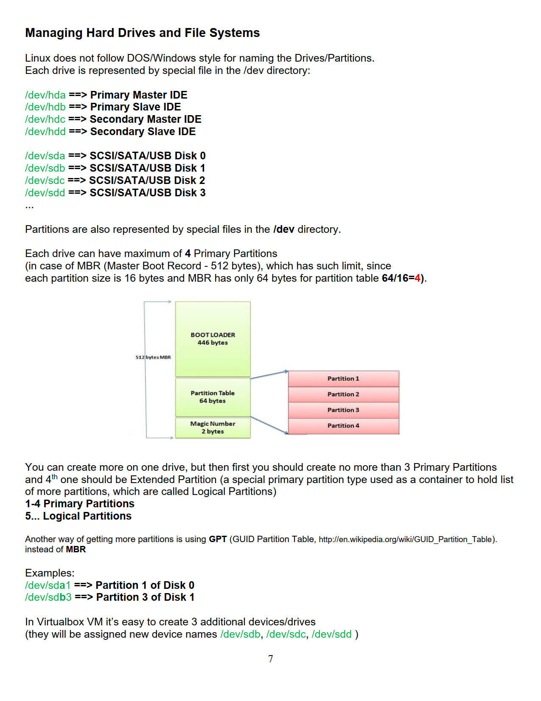
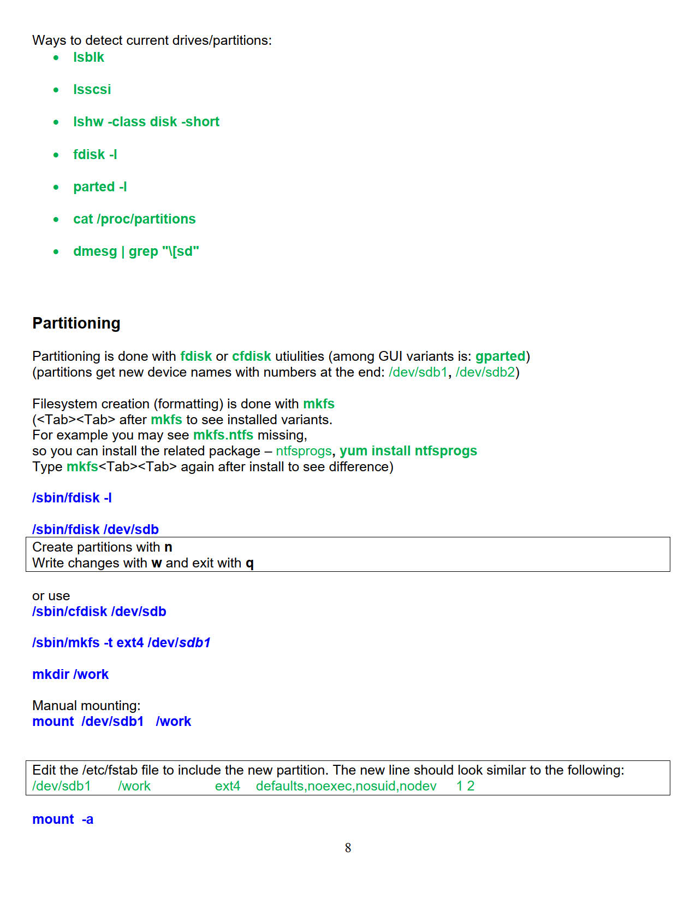
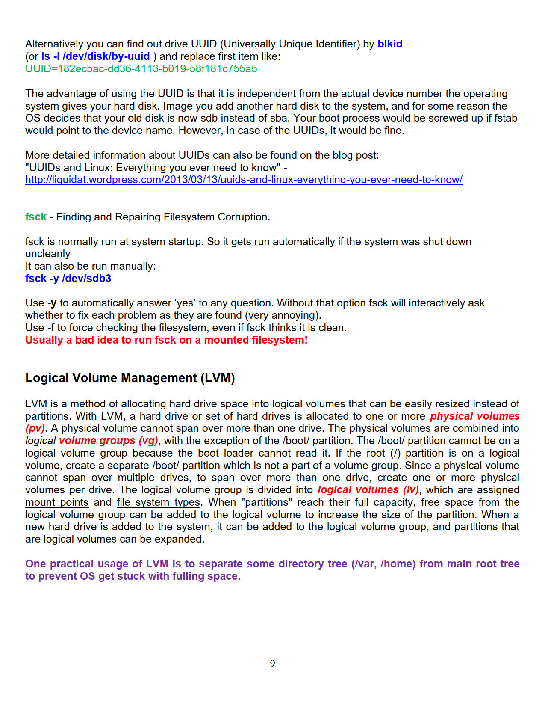
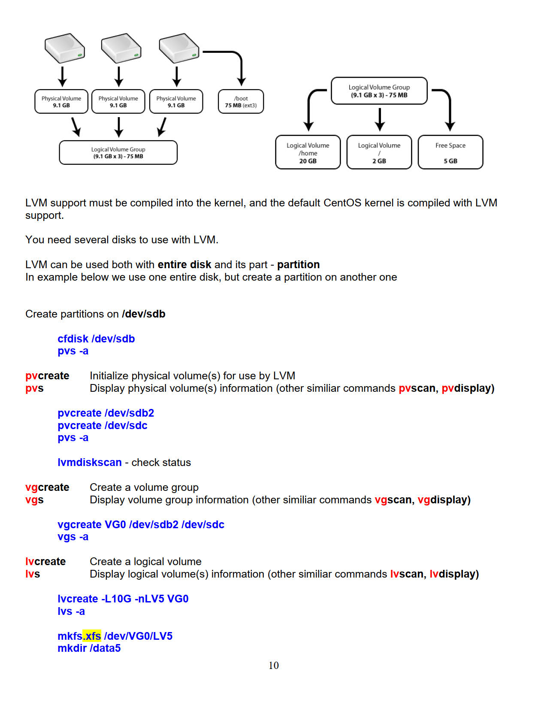
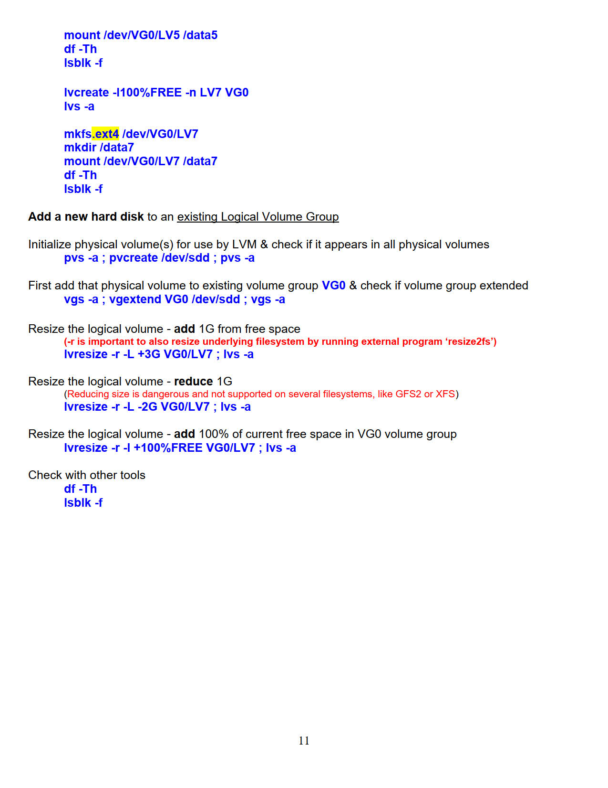

# Linux Administration and Networking Basics (Level 2) <br> Լինուքսի կառավարում և ցանցային հիմունքներ (փուլ 2)

## Managing LVM <br>LVM-ի կառավարում

🧱 Logical Volume Management (LVM)

LVM is a flexible way to manage disk space in Linux. 
Instead of using fixed partitions, you create layers of abstraction:

* **🧱 Physical Volumes (PV)**: Real disk partitions or entire disks.

* **🗃️ Volume Groups (VG)**: Pools of storage made from one or more PVs.

* **📦 Logical Volumes (LV)**: Usable "virtual partitions" from VGs, mountable like normal partitions.

💡 Unlike traditional partitions, LVM allows resizing and combining storage even across multiple disks.

> Note: The `/boot` partition must NOT be on an LV, as bootloaders can’t read LVM.


✅ LVM Benefits

* 🔄 Resize volumes anytime
* ➕ Add disks to extend storage
* 📸 Snapshots for backups
* 📊 Efficient space utilization


### LVM Structure Diagram

🧩 LVM Structure Diagram

<pre>
💽 Physical Disks and Partitions
┌───────────────────────┐   ┌───────────────────────┐   ┌───────────────────────┐
│      /dev/sda         │   │      /dev/sdb         │   │      /dev/sdc         │
├───────────┬───────────┤   │                       │   │                       │
│ /dev/sda1 │ /dev/sda2 │   │         LVM           │   │         LVM           │
│           │    LVM    │   │  Physical Volume (PV) │   │  Physical Volume (PV) │
│ Mounted at│  Physical │   │                       │   │                       │
│  /boot    │   Volume  │   │                       │   │                       │
│           │    (PV)   │   │                       │   │                       │
└───────────┴───────────┘   └───────────────────────┘   └───────────────────────┘
                  │                    │                          │
                  │                    │                          │
🗃️ Volume Groups  ▼                    ▼                          ▼
             ┌─────────────────────────────────────────────────────────┐
             │                 LVM Volume Group (VG)                   │
             └─────────────────────────────────────────────────────────┘
                                       │
                                       │
                   ┌───────────────────┼───────────────────────┐
📦 Logical Volumes  ▼                  ▼                       ▼
       ┌──────────────┐         ┌─────────────┐         ┌─────────────┐
       │      LVM     │         │     LVM     │         │     LVM     │
       │    Logical   │         │   Logical   │         │   Logical   │
       │  Volume (LV) │         │ Volume (LV) │         │ Volume (LV) │
       │    lv_root   │         │   lv_home   │         │    lv_var   │
       │  Mounted at  │         │  Mounted at │         │ Mounted at  │
       │       /      │         │    /home    │         │    /var     │
       └──────────────┘         └─────────────┘         └─────────────┘
</pre>


```mermaid
flowchart TD
    subgraph Disks["💽 Physical Disks"]
        sda[/dev/sda]
        sdb[/dev/sdb]
        sdc[/dev/sdc]
    end

    subgraph sda_part[" "]
        sda1[/dev/sda1\n/boot]
        sda2[/dev/sda2\nLVM PV]
    end

    sda --> sda1
    sda --> sda2
    sdb --> pv1[LVM PV]
    sdc --> pv2[LVM PV]

    subgraph VG["🗃️ Volume Group"]
        vg[(VG)]
    end

    sda2 --> vg
    pv1 --> vg
    pv2 --> vg

    subgraph LVs["📦 Logical Volumes"]
        root[LV: lv_root\n/]
        home[LV: lv_home\n/home]
        var[LV: lv_var\n/var]
    end

    vg --> root
    vg --> home
    vg --> var
```


### /boot Must Be Outside LVM

🚫 Why /boot Must Be Outside LVM (Usually)

The /boot partition contains:

    The Linux kernel (vmlinuz)

    The initramfs/initrd

    The GRUB bootloader files

⚠️ Problem:

At boot time, before the kernel is loaded, only the bootloader (usually GRUB) is running — and bootloaders have limited capabilities. GRUB cannot reliably read LVM volumes, especially in older systems or minimal setups.
✅ Solution:

Create a separate, non-LVM /boot partition (e.g., /dev/sda1) formatted with a standard filesystem like ext4. This allows GRUB to:

    Easily access the kernel and initramfs

    Boot into the system cleanly

🔁 Analogy:

Think of LVM as a vault. The key (kernel/initrd) must be stored outside the vault so the system can unlock and use it.


🔒 LVM needs kernel support.	Bootloader runs before the kernel is loaded
🚫 GRUB limitations.	May not understand LVM without help
🛠️ Recovery simplicity.	Easier to fix boot issues with plain /boot


✅ Best Practice: 
Use a small `/boot` partition (~512 MB–1 GB) at the beginning of the disk.

⚠️Another Problem: Kernel updates, may get that partition full !!! 









