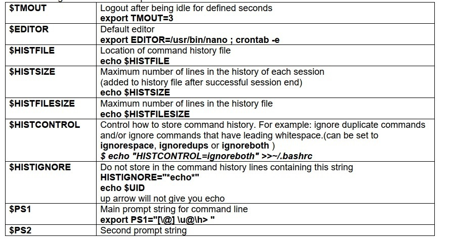
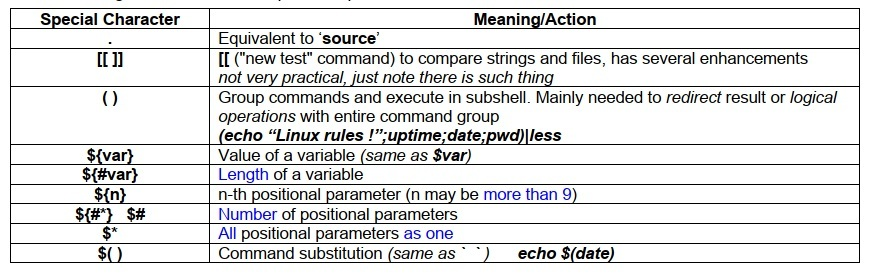

# Linux Administration and Networking Basics (level 2) Linux-ի կառավարում և ցանցային հիմունքներ (փուլ 2)


##  Advanced BASH Shell Scripting


*Quick initial script example*


```bash
cat  > ~/ex1.sh  << "EOF1"
#!/bin/bash
if [ -z ${1} ]; then
echo "Usage: $0 number of loops"
exit
fi
echo "How do you like it:"
for (( i=1; i<=${1}; i++ ))
do
    for (( j=1; j<=i;  j++ ))
    do
     echo -n "$i"
    done
    echo ""
done
EOF1
chmod +x ~/ex1.sh

```

### Variables
Bash variables - temporary storage for information
Bash does not care about the type of variables. 
Variables could store strings, characters or integers. 

Variable names are uppercase by convention, but any symbols can be used.

Syntax:
VARNAME=VALUE
Note: There should be no space around “=” sign 

The following script creates a variable called LIST and assigns the value “/usr/bin”. 
Prefix the variable name with $, which will give the value stored in that variable.

#### PRACTICE

*Example.1 Simple Bash Variable Assignment Usage*

```bash
cat  > ~/sample.sh  << "EOF1"
#!/bin/bash
LIST="/usr/bin/"
ls -l $LIST
EOF1
chmod +x ~/sample.sh
```

Execute the above script, which will list the /usr/bin in long format.

**Task: Modify the script to work with 1-st positional parameter.**

### Bash Variable Scope – Local and Global 

In Bash, variables do not have to be declared. When you access the variable which is not used so far, 
you will not get any warning or error message. Instead, it will display a blank value. 

*Example 2. Blank values in bash variables* 


```bash
cat > ~/var1.sh << "EOF1"
#!/bin/bash 
echo "Variable value is: $VAR1" 
VAR1="LINUX" 
echo "Variable value is: $VAR1" 
EOF1
chmod +x ~/var1.sh
```

Initially the variable will have a blank value, after assigning, you can get your values.  
export command is used to export a variables from an interactive shell.  
export shows the effect on the scope of variables. 

`VAR1=UNIX ; ./var1.sh`

 
Still you will get blank value for variable VAR1. The shell stores variable VAR1 with the LINUX only in 
the current shell. During the execution of var1.sh, it spawns the subshell and it executes the script. So 
the variable VAR1 will not have the value in the spawned shell.  
You need to export the variable for it to be inherited by another program – including a shell script, as 
shown below. 

`export VAR1=UNIX ; ./var1.sh `

Now, you can notice that after execution of the shell script var1.sh, the value of VAR1 is UNIX. Because 
the variables will not be passed back to your interactive shell, unless you execute the script in the 
current shell 


**Global variables** (also called **environment variables**) - available to all shells. 
The `env` or `printenv` commands can be used to display environment variables. 

**Local variables** are visible only within the block of code.  
Using the `set` built-in command without any options will display a list of all variables 
(including environment variables) and functions.  

In a function, a local variable has meaning only within that function block. 

`$ set | grep HIST` 

The following table lists some important Bash internal variables that can be redefined:  




#### Special Characters 
The following table lists some important special characters:  


#### Arrays

_ARRAY=(value1 value2 ... valueN)_ 

Contents of an array element is available as  _${ARRAY[valueN]}_

Example:

```bash
AR=( zero one two three four five ) # define the array 
echo ${AR[2]} # get the 2-nd element 
echo ${AR[*]} # get the whole array 
```

Simple script

`cat > ./mkuniq` 

```bash
#!/bin/bash 
# Create an array "INPUT" from all positional parameters. 
INPUT=( 1 2 3 4 11 12 3 4 55 6 77 77 55 9 3) 
# 
# Create another array "UNIQ" from the output of the 3 command pipe grouped togehter. 
# "tr" replaces spaces with newlines, so each element is now on separate line. 
# We operate with lines by sorting them with "sort" and then removing duplicates with "uniq" 
UNIQ=( $(echo ${INPUT[@]} | tr ' ' '\n' | sort | uniq) ) 
# 
# Output each value from new array 
for VAR in ${UNIQ[@]}; do 
    echo $VAR 
done 
```

##### Task1: 
Modify script sort numbers correctly 

##### Task2: 
Modify script to:  
1. create array “INPUT” from all positional parameters 
2. output usage if no parameters are given 

#### Signal Traps 

Bash has an internal trap command to reassign the signal actions, which can be useful in scripts. 
The format of the trap command is:  _trap 'commands'  signals_ 

Common example:

```bash
trap ' ' 2 3 15 # sets do nothing when receiving 2 (INT, Ctrl+C), 3 (QUIT, Ctrl+\), 15 (TERM) signals. 
trap 2 3 15 # recovers initial actions for 2,3,15 signals.
```

Simple script

`cat > trap.sh` 

```bash
#!/bin/bash 
trap 'echo " Ctrl-C IGNORED" ' 2 
trap 'echo " Ctrl-\ IGNORED" ' 3 
while true ; do 
echo 'Try to stop me with Ctrl-C, Ctrl-\' 
sleep 5 
done 
```

After running the above script you **will not be able to stop it.** 

To stop it press `Ctrl-Z`

and then run:  `kill -9 %1` 


#### Here Documents 

A here document  is a special-purpose code block.  
It uses a form of I/O redirection to feed data to program/command. 
A limit string delineates (frames) the command list. The special symbol _<<_ designates the limit string. 
This has the effect of redirecting the output of a file into the _stdin_ of the program or command. 

Example script

`cat > here.sh` 

```bash
#!/bin/bash 
mkdir  /tmp/here 
PDIR="/tmp/here" 
exec < /etc/passwd 
while read VAR 
do 
UNM=`echo $VAR |awk -F":" '{print $1}'` 
HM=`echo $VAR |awk -F":" '{print $6}'` 
FNAME=`echo $VAR |awk -F":" '{print $5}'` 
cat <<EOPF > $PDIR/$UNM.txt 
Special file for: $FNAME 
Home dir: $HM 
EOPF 
chmod 600 $PDIR/$UNM.txt 
echo "Created file: $FNAME ($HM - $UNM)" 
done 
```

An `exec < filename` command redirects the contents of filename to _stdin_. From that point on, all _stdin_ 
comes from that file, rather than its normal source (usually keyboard input). This provides a method of 
reading a file line by line and possibly parsing each line of input. 


#### Functions

Functions in Bash allow us to easily re-use code making the code easier to manage and read. 
When your scripts are getting a little more complex it’s good to spend a little bit of time thinking about
how you structure them and if there are repeating tasks - make them a function 

Functions are called simply by invoking their names.  

_A function call is equivalent to a command._ 

The function definition must precede the first call to it.


Bash function syntax variants: 
```bash
function_name () { 
commands... 
} 
```

or

```bash
function function_name { 
commands... 
} 
```

Most other programming languages have the concept of a return value for functions, a means for the 
function to send data back to the original calling location. Bash functions don't allow us to do this.  
But you may give values to the function the same way you do that for script – with $1, $2, ...  

Examples

`cat > f1.sh`

```bash
#!/bin/bash 
somef () {  
echo "We learn $1" 
} 

somef Linux 
somef Unix 
```

`cat > f2.sh` 

```bash
#!/bin/bash 
linefile () { 
cat $1 | wc -l 
} 
NUML=$(linefile $1) 
echo The file $1 has $NUML lines in it. 
```

Functions allow to have local variables, which will be available only within this function: 
_local var_name=<var_value>_ 

Example of variable scope 

`cat > f3.sh`
 
```bash
#!/bin/bash 
var_change () { 
local VAR1='LOCAL 1' 
echo "INSIDE: VAR1 is $VAR1" 
echo "INSIDE: VAR2 is $VAR2" 
VAR1='CHANGED 1' 
VAR2='CHANGED 2' 
} 
VAR1='GLOBAL 1' 
VAR2='GLOBAL 2' 
echo "Before function call: VAR1 is $VAR1" 
echo "Before function call: VAR2 is $VAR2" 
var_change 
echo "After function call: VAR1 is $VAR1" 
echo "After function call: VAR2 is $VAR2" 
```

* RECOMMENDATION: It’s best to always use local variables within functions.  
Think before using global variables within function. 

Let’s change the previous script to have functions 

`cat > f4.sh `

```bash
#!/bin/bash 
mytrap1() 
{ 
echo "Ctrl-C IGNORED" 
} 
mytrap2() 
{ 
echo "Ctrl-\ IGNORED" 
} 
trap 'mytrap1' 2 
trap 'mytrap2' 3 
while true ; do 
echo 'Try to stop me with Ctrl-C, Ctrl-\' 
sleep 5 
done 
```
 

#### Arithmetic Expansion. Double-Parentheses Construct. 

Arithmetic operations in Bash can be done in several ways. 

1. ‘Old’ ways were using let  
`let a="1+6" ;echo $a `

2. or expr 
`b=`expr 2 + 5` ; echo $b` 
3. Newer versions of Bash have other way: double parentheses. 
**(( ... ))** construct permits arithmetic expansion and evaluation. 
In its simplest form, _a=$(( 5 + 3 ))_ would set a to 5 + 3, or 8. 
However, this double-parentheses construct is also a mechanism for allowing C-style manipulation of 
variables in Bash, for example increments like (( var++ )) or (( var+=5 )). 
`$ z=$((4+3)); echo $z `


Example of a shell script  that calculates the average of all command line parameters 

`cat > aver.sh `

```bash
#!/bin/bash 
if [[ $# = 0 ]] 
then echo "Usage: $0 num1, num2 ..." 
exit 
fi 
(( m= 0 )) 
isnumber () 
{ 
if [ $1 -eq $1 2>/dev/null ] 
then  
((m+=1)) 
else echo "$1 is not a number" 
 exit $? 
fi 
} 
(( sum=0 )) 
for i in $* 
do 
if  isnumber $i 
then  
((sum+=$i)) 
fi 
done 

((AV=sum/m)) 
echo "For $* " 
echo  “Average is $AV” 
```


### Advanced Text Processing - AWK 

Awk is a full-featured text processing language very useful in shell scripts.  
It is ideal for handling structured text files where data can be viewed as organized into consistent 
chunks, such as rows and columns. 


Awk main principle is – _**'pattern { action }'**_  

**_pattern_** – if present causes to select only lines containing that pattern, 
after that  **_{ action }_** is applied to that lines. 

Awk breaks each processed line into **_fields_** - by default delimited by whitespace. 

Strong quoting and curly brackets enclose blocks of awk code - **_'{   }'_**.   
**$1** is field #1, **$2** is field #2, etc.

**awk '{print $1 $5 $6}' $filename** # Prints fields #1, #5, and #6 of file $filename. 
**awk '{print $0}' $filename** # Prints the entire file! 

Awk can be used to parse many system administration files. However, many of these files do not have 
whitespace as a separator. as an example, the password file uses colons. You can easily change the 
field separator character to be a colon using the "-F" command line option. The following command will 
print out list of user accounts:  

`awk -F":" '{print $1}' /etc/passwd`

Exmaple

`cat /etc/passwd | awk -F":" '/nologin$/ {print $1"-"$5}'`


##### Task:
Modify the above command, to narrow selection by only lines starting with s  

#### Advanced Text Processing – SED 

Sed is a very useful **S**tream **ED**itor.  
It's ideal for batch-editing files or for creating shell scripts to modify existing files in powerful ways. 
It's rather complex for quick full understanding, so below are only few use cases.

One of sed's most useful commands is the _**substitution**_ command. 

Following command takes a stream from pipe and replaces first occurrence of `:` on each line to `<*>`: 

`cat /etc/passwd | sed -e 's/:/<*>/' `

To replace all occurrences we should add `g` to make replacement global: 

`cat /etc/passwd | sed -e 's/:/<*>/g'  `


Another useful examples with SED: 

Output lines `5-7` 

`sed -n '5,7p' /etc/group`

**-n** causes not to output each processed lines<br>
**p** command specifies print (output) specified line range: 5-7 


Output all lines except `1-20` 

`sed '1,20d' /etc/group`

**d** command causes specified line range: 
`1-20` to be deleted/removed from output, 
other lines will be present in output 

Remove comments (lines starting with '#' - `^#`) and empty lines `^$` from output:  

`sed '/^#\|^$/d' /etc/rsyslog.conf` 

**d** command causes specified lines: <br>
**^#** - starting with **#** <br>
or **\\|** <br>
**^$** - empty line (**^**- line start, **$** - line end) 
to be deleted/removed from output, 
other lines will be present in output. 


##### Task: 
Modify the above command, to remove also lines starting with **$** 


