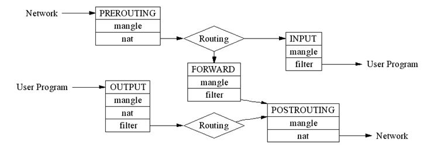

# Linux Network Server (level 3) <br /> Linux ցանցային սերվեր (փուլ 3)

## Linux firewall, packet filtering, iptables 

Linux kernel includes network firewall capabilities to filter packets (called **netfilter**).

To use these capabilities different Linux distributions and versions use different tools.

* **IPtables**
* **Firewalld**
* **Uncomplicated Firewall (ufw)**

### IPtables
IPtables is initial tool to manage packet filtering, but newer Linux versions
provide other "front-end" tools for `iptables`. 

For example **CentOS 7/8** come with an alternative service called `firewalld`
which fulfills this same purpose & **Ubuntu** versions now use `ufw` (Uncomplicated Firewall).

Also CentOS versions may have `iptables` as special package/service, 
with some predefined chains/rules.

To have clear config for learning we can check and stop/disable such services if any:
```bash
systemctl status iptables

systemctl stop iptables
systemctl disable iptables
````

```bash
systemctl status firewalld

systemctl stop firewalld 
systemctl disable firewalld 
````

```bash
systemctl status ufw

systemctl stop ufw 
systemctl disable ufw 
````

First we will get understanding of `iptables`, since it's anyway remaining
at the bottom of any modern netfilter-based Linux firewall.

`iptables -L -v -n`

This command will give the list of all current active **chains** & **rules**. 



Basic chains are:

* INPUT - for packets coming **into** the network interface from outside.


* FORWARD - for packets **transiting** between two network interfaces.


* OUTPUT - for packets going going **out** from network interface to outside.

For each chain a sequence of **rules** with appropriate **actions** can be defined.

Each rule can specify filtering parameters (like Source/Destination IP address)
and if packet fits the **action** for that rule will be taken.

Basic actions are: 
* ACCEPT
* REJECT
* DROP

For each chain there is **default action** - final decision what to do with packets that did not fit any rule in that chain. 

Standard default action is **ACCEPT**.

<br>
<br>

#### PRACTICE

Add rule to INPUT chain:<br>
```bash
iptables -A INPUT -d 127.0.0.2 --jump REJECT
```

Check: `iptables -L -v -n`

Try if it works:
```bash
ping -c 1 127.0.0.2
```

Check again: `iptables -L -v -n` <br>
You should see 1 more packet (in **pkts** column) filtered for that rule.


Now remove that rule:
```bash
iptables -D INPUT -d 127.0.0.2 --jump REJECT 
``` 
It is also possible to remove all rules: 
```bash
iptables -F
````

Check:<br> `iptables -L -v -n`

Try if it works:
```bash
ping -c 1 127.0.0.2
```

We can allow only outgoing traffic.
Here we specify **default** rules with `-P` option:
```bash
iptables -P INPUT DROP ; \
iptables -A INPUT -m state --state RELATED,ESTABLISHED -j ACCEPT 
```

Last rule allows only those packets, which are parts of some already established session.

Check:
```bash
ping -c 2 8.8.8.8
iptables -L -v -n 
```
ping should work and you should see increase in number of 'pkts' for "RELATED,ESTABLISHED" chain

```bash
ping -c 2 127.0.0.1
iptables -L -v -n 
```
ping should not work and you should see increase in number of packets for default INPUT 'polycy DROP'

> * Can you explain the reason of this difference?

Now we can clear (flush) all rules<br> and restore default actions for INPUT & OUTPUT chains:
```bash
iptables -P INPUT ACCEPT  ;\
iptables -F 
```

And check the difference:
```bash
iptables -L -v -n 
ping -c2 8.8.8.8
ping -c2 127.0.0.1
```

We can block some specific IP-address or subnet
```bash
iptables -A INPUT -s 8.8.8.8/16 -j DROP ;\
iptables -A INPUT -s 1.1.1.1 -j DROP
```

Check:
```bash
iptables -L -v -n 
ping -c 2 8.8.8.8
ping -c 2 8.8.4.4
ping -c 2 1.1.1.1
```
> * Can you explain why ping doesn't work, when we only restricted INPUT ?


Clear:
```bash
iptables -F
```

Check:
```bash
iptables -L -v -n 
ping -c 2 8.8.8.8
ping -c 2 8.8.4.4
ping -c 2 1.1.1.1
```

Now we set rules for OUTPUT chain
```bash
iptables -F ;\
iptables -A OUTPUT -d 8.8.8.8/16 -j DROP ;\
iptables -A OUTPUT -d 1.1.1.1 -j DROP
```

Check:
```bash
iptables -L -v -n 
ping -c 2 8.8.8.8
ping -c 2 8.8.4.4
ping -c 2 1.1.1.1
```

> * Can you explain the difference of restricting only INPUT or OUTPUT ?
> * Is one of them enough, or both are needed ?

We can block some port (note that the `-p` protocol option is required 
for ports)
```bash
iptables -A OUTPUT -p tcp --dport 80 -j DROP
```
 
Try:
```bash
telnet fb.com 80 
```

> * Change the rule to filter in INPUT chain


```bash
iptables -A INPUT -p tcp --dport 22 -j REJECT
```
 
Try:
```bash
ssh 127.0.0.1 
```

> * What the difference will be if we set 'DROP' instead of 'REJECT'

Clear:
```bash
iptables -F
```

We can combine multiple options in rules, and also 
specify the network interface <br>(`-i` for _incoming_ , `-o` for outgoing).

```bash
iptables -A OUTPUT -o lo -p icmp -d 127.1.2.3/24 --icmp-type echo-request -j REJECT --reject-with icmp-host-prohibited
iptables -A INPUT -i enp0s3 -p icmp -s 9.9.9.9 --icmp-type echo-reply -j DROP
```

> NOTE: 
> 1. we filter once for INPUT and another time for OUTPUT 
> 2. depending on the expected packet we use different ICMP types:
>    * `--icmp-type echo-request` - for OUTPUT
>    * `--icmp-type echo-reply` - for INPUT

Try:
```bash
ping -c 2 127.1.2.3
ping -c 2 9.9.9.9
```

> ICMP error messages that can be added if **REJECT** method is used:<br>
>* `--reject-with icmp-host-prohibited`
>* `--reject-with icmp-net-prohibited`
>* `--reject-with icmp-net-unreachable`
>* `--reject-with icmp-host-unreachable`


We can limit the number of connections per IP address (uses **connlimit** module)
Here we allow only 1 SSH connection per IP address:
```bash
iptables -A INPUT -p tcp --syn -d 127.0.0.1 --dport 22 -m connlimit --connlimit-above 1 -j REJECT 
```
Now try connecting with ssh twice.

```bash
ssh student@127.0.0.1
ssh student@127.0.0.1
```

But this will work both times, since we block only 127.0.0.1
```bash
ssh student@127.0.0.2
ssh student@127.0.0.2
```


Multiple ports can be blocked in ine rule with **multiport** module
Here we block Microsoft-DS and Netbios ports for both TCP & UDP
```bash
iptables -A FORWARD -p tcp -m multiport --dport 445,137,138,139  -j DROP
iptables -A FORWARD -p udp -m multiport --dport 445,137,138,139  -j DROP
```

Note that here FORWARD chain is used, so this is example of filtering **transit** traffic.

Mac-based blocking is also possible with **mac** module:
In this example we only accept traffic for TCP port 22 from mac 00:19:99:3C:AB:22 
```bash
iptables -A INPUT -p tcp --destination-port 22 -m mac --mac-source 00:19:99:3C:AB:22 -j ACCEPT
iptables -A INPUT -p tcp --destination-port 22 -j REJECT
```

Examples with NAT

NAT is special case. To see NAT table specify table name with `-t nat`:
```bash
iptables -nvL -t nat
```

We need to set rules in special chain POSTROUTING:
```bash
iptables -t nat -A POSTROUTING -d 127.100.0.0/16 -j SNAT --to-source 127.5.5.5 ;\
iptables -t nat -A POSTROUTING -d 127.200.0.0/16 -j SNAT --to-source 127.7.7.7
```

Try connecting to localhost with different IPs to see the effect of NAT rules
```bash
ssh student@127.100.0.1
w
ssh student@127.200.0.1
w
```
You should see **student** logins from:
* 127.5.5.5
* 127.7.7.7

To clear/drop all current rules in NAT table specify table name with `-t`
```bash
iptables -F -t nat
```


