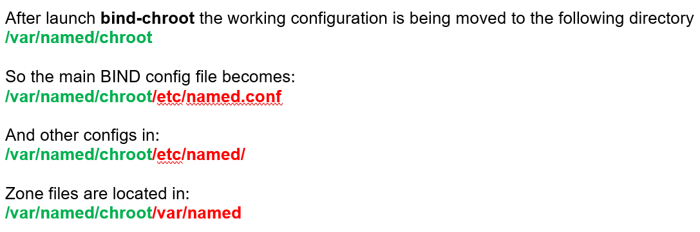

# Linux Network Server (level 3) <br /> Linux ցանցային սերվեր (փուլ 3)

## DNS Server (BIND, Berkeley Internet Name Domain/Daemon)

Basic knowledge of DNS is essential for this part.

Some URLs:

`https://www.dnstree.com/`
`https://simpledns.plus/lookup-dg`
`http://www.kloth.net/services/dig.php`
`http://dns.squish.net/`
`https://dnsdumpster.com/`


We may need few DNS utilities:
`dig [options] <domain/ip> <name-server>`

`host [options] <domain/ip> <name-server>`

You may need to install bind-utils package:
```bash
yum -y install bind-utils
```

Use examples:

`host -t aaaa gmail.com 8.8.8.8`

`dig -t soa ya.ru @8.8.8.8`

`host -v fb.com`

`host -a mail.ru`

`host 8.8.4.4 8.8.8.8`

`dig -x 8.8.4.4 @8.8.8.8`


We will use BIND package for DNS server. BIND is free and one of the most widespread solution for implementation of Domain Name System (DNS) server.
CentOS has special package for secure DNS server configuration `bind-chroot`.

BIND Installation:
```bash
yum -y install bind-chroot
```

Non-chroot BIND version (if any) should be stopped and disabled	
```bash
systemctl stop named ; \
systemctl disable named
```

Setup chroot environment for BIND:
```bash
/usr/libexec/setup-named-chroot.sh /var/named/chroot on
```

Enable service
```bash
systemctl enable named-chroot
```

Manually start it
```bash
systemctl start named-chroot
```

Check
```bash
systemctl status named-chroot -l 
ps ax | grep named
netstat -nlptu | grep named
ss -nlptu | grep named
```

Since SELinux (Security-Enhanced Linux) and firewalld 
may cause problems, we will turn them off for the training period.

Turn off firewalld
```bash
systemctl stop firewalld
systemctl disable firewalld
```

Turn off SELinux 
```bash
setenforce 0
```
`nano /etc/sysconfig/selinux`

```bash
# SELINUX=enforcing
SELINUX=disabled`
```

Main BIND config file is `/etc/named.conf`
Also additional configs may be in: `/etc/named/`

But in case of **bind-chroot** there is a trick.

After launch **bind-chroot** the working configuration 
is being moved to the following directory `/var/named/chroot`

> Thus all WORKING ACTIVE configuration has preceding
> `/var/named/chroot` prefix added to the path of any config file.



So the main BIND config file becomes:	
`/var/named/chroot/etc/named.conf`

And other configs are now in:
`/var/named/chroot/etc/named/`

Zone files are located in:
`/var/named/chroot/var/named`

> IMPORTANT ! <br>
> If **bind-chroot** is **RUNNING**, then edit `named.conf` or other 
> config/zone files **in chroot environment**, under 
> `/var/named/chroot`
> (for example `/var/named/chroot/etc/named.conf`)
> <br><br>
> If **bind-chroot** is STOPPED then edit `named.conf` or other 
> config/zone files in their default locations
> `/etc/` & `/var/named`
> (for example `/etc/named.conf`)
> 
> Don't forget to restart **bind-chroot** after each configuration change.


1.Make few changes in default config.

Default config listens only to `127.0.0.1` and serves only queries from `localhost`

We will change it for training purposes.
Open `/var/named/chroot/etc/named.conf`

find section `options { … }`
and change:
> listen-on port 53 { 127.0.0.1; };	

to	
>  listen-on port 53 { any; }; 

also change:
> allow-query     { localhost; };

to

> allow-query     { any; }; 


> Each student should create own domain zone:
> lt0N.am  (N – student’s number assigned by trainer)
> Trainer’s zone will be lt00.am,  
> Students zones: lt01.am, lt02.am, …
> (here and below each student should change the number 1 
> to his/her number assigned by trainer 
> REMEMBER to include green part if bind-chroot is started 
> and to omit it if bind-chroot is stopped)

2.Create master zone config file `/var/named/chroot/etc/named/lt01.am.zone`

```bash
cat >> /var/named/chroot/etc/named/lt01.am.zone
```

> ```bash
> zone "lt01.am." IN {
>         type master;
>         file "lt01.am.db";
> };
> ```

3.Include it in main config file `/var/named/chroot/etc/named.conf`

```bash
cat  >> /var/named/chroot/etc/named.conf
```
> ```bash
> include "/etc/named/lt01.am.zone";
> ```

4.Create master zone data file 
`/var/named/chroot/var/named/lt01.am.db`

```bash
cat >> /var/named/chroot/var/named/lt01.am.db
```

> ```bash
> $TTL 1H
> @       SOA     ns.lt01.am.     dns.lt01.am. ( 2021121100
>               				3H ; refresh
>               				1H ; retry
>               				1W ; expire
>               				1H ) ; minimum
>               	            		NS      ns.lt01.am.
>               	            		MX      0 mail
>               	             		A       10.10.1.1
> www			      A       10.10.1.1
> ns			      A       10.10.1.2
> mail			      A       10.10.1.3
> ```

5.Restart the service

```bash
systemctl restart named-chroot
```


6.Check

```bash
host -t soa lt01.am 127.0.0.1
dig -t soa lt01.am @127.0.0.1
```

#### PRACTICE

Create new resource record in your zone `lt01.am`.
> ```bash
> type:   A 
> name:   stat
> value:  10.10.1.50 
> ```


### Reverse Zones

Create Reverse Zone    `1.10.10.in-addr.arpa.`

1.Create master reverse zone config file `/var/named/chroot/etc/named/10.10.1.zone`

```bash
cat >> /var/named/chroot/etc/named/10.10.1.zone
```
> ```bash
> zone "1.10.10.in-addr.arpa." IN {
>         type master;
>         file "10.10.1.rev.db";
> };
> ```

2.Include it in main config file `/var/named/chroot/etc/named.conf`

```bash
cat  >> /var/named/chroot/etc/named.conf
```
> ```bash
> include "/etc/named/10.10.1.zone";
> ```

3.Create master reverse zone data file `/var/named/chroot/var/named/10.10.1.rev.db`

```bash
cat >> /var/named/chroot/var/named/10.10.1.rev.db
```
>```bash
> $TTL 1H
> @       SOA     ns.lt01.am.     dns.lt01.am. (2021121100
>           	                                      3H ; refresh
>          	                                      1H ; retry
>          	                                      1W ; expire
>          	                                      1H ) ; minimum
>                NS		ns.lt01.am.
>1		PTR		www.lt01.am.
>2		PTR		ns.lt01.am.
>3		PTR		mail.lt01.am.
>```


4.Restart the service
```bash
systemctl restart named-chroot 
```

5.Check
```bash
systemctl status named-chroot.service -l  |  grep '1.10.10'
host 10.10.1.1 127.0.0.1
dig -x 10.10.1.1 @127.0.0.1
```

#### PRACTICE

Create new resource record in your zone `1.10.10.in-addr.arpa.`
> ```bash 
> type:		PTR
> name:  		50
> value:		stat.lt01.am.
> ```


### Slave Zones

On another server install bind-chroot and create configuration to get zone copy as Slave Zone.  
(no numbers need to be changed below)

1.Create slave zone config file `/var/named/chroot/etc/named/lt01.am.zone`

```bash
cat >> /var/named/chroot/etc/named/lt01.am.zone
```
>```bash
>zone "lt01.am." IN {
>        	type slave;
>masters { 192.168.1.1; };
>        	file "slaves/lt01.am.db";
> 	masterfile-format text;
>};
>```
>

2.Include it in main config file `/var/named/chroot/etc/named.conf`

```bash
cat  >> /var/named/chroot/etc/named.conf
```

> ```bash
> include "/etc/named/lt01.am.zone";
> ```


3.Restart the service
```bash
systemctl restart named-chroot
```

If no config errors made "Zone transfer" should take place
and local file `/var/named/chroot/var/named/lt01.am.db` should appear.

Check if the slave zone data file `/var/named/chroot/var/named/lt01.am.db` was created
```bash
ls -l /var/named/chroot/var/named/
```

Check that our local service gives result from slave zone:
```bash
host -t soa lt01.am 127.0.0.1
dig -t soa lt01.am @127.0.0.1
```

#### PRACTICE

Create configuration to get a Slave Zone copy for zone `1.10.10.in-addr.arpa`


### Advanced configuration:
There are lots of options for advanced BIND configuration. They can be used both in main 
`options { … }`  part, as well as in each zone description 
parts `zone lt01.am. IN { ... }`

Examples:
```
acl local-ips   { 172.16.1.0/24; 192.168.0.0/16;  };  
acl slave-ips   { 192.168.0.0/16; };  
options {
	version "GO AWAY";	// Hide BIND Version
	allow-transfer {		// Zone Transfers allowed only for slaves
                127.0.0.1/32;           	
                 slave-ips;             	
                 };
	allow-recursion {  		// Recursion allowed only for local IPs
                127.0.0.1/32;           	
                 local-ips;            	
                 }; 
	notify yes;			// Send notification to slaves about master zone changes
	   };
```

Check the BIND version 
```bash
dig chaos txt version.bind @127.0.0.1
```


