# Shell programming in Linux

## Linux Terminal (Լինուքսի հրամանների տողը)

> Ներածական հարցեր թեմայի վերաբերյալ 
* Ծանո՞թ եք տերմինալի միջոցով Linux-ում աշխատելուն:
* Եթե այո ի՞նչ ծրագրի միջոցով:
* Ծանո՞թ եք SSH-ով միանալուն:

Լինուքս համակարգ մուտքագրվելու համար պետք է տրամադրել անունը (username) և գաղտնաբառը (password):

SSH-ով միանալու պարագայում գաղտնաբառի փոխարեն հնարավոր է մուտքը զույգ-բանալիներով (Public/Private Keys)

Մուտքագրվելիս Լինուքս համակարգ հնարավոր է աշխատել հետևյալ տարբերակներից մեկով. 
* Graphical User Interface (GUI)
* Command Line Interface (CLI)/Terminal

Այս դասընթացի ընթացքում մենք կաշխատենք երկրորդ տարբերակով:

### Linux Terminal, CLI Basics

> Լինուքսի յուրահատկությունը

* Մեծատառի/փոքրատառի տարբերություն (LiNuX iS CaSe SeNsItIvE)
  * Հրամանների և ծրագրերի անվանման մեջ 
    * Command 
    * COMMAND 
  * Ֆայլերի և դիրեկտորիաների անվանման մեջ
    * File
    * FILE
  * Օգտագործողների և խմբերի անվանման մեջ
    * user
    * User

> Command Prompt

**$** - User Prompt

**#** - ROOT Prompt

> Command History 
* Վերևի սլաքը (Up Arrow) նախորդ հրամանները

> Filename/Command completion 	
* [Tab]	հրամանի/ֆայլի լրացում
* [Tab] [Tab]	լրացում բոլոր տարբերակների ցուցադրում

> Movement:	
* Ctrl-A – mտեղափոխել տողի սկիզբ
* Ctrl-E – տեղափոխել տողի վերջ

> Հրամանների կառուցվածք
 
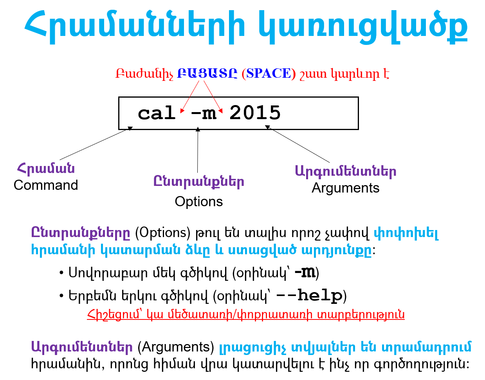

> Հրամանների օրինակներ

* cal - display a calendar

  * `cal`
  * `cal 2 2015`
  * `cal -m 2 2015`

* date - display date

  * `date`
  * `date --help`
  * `date +"%d-%m-%Y"`
  
* echo - display a line of text 
  * `echo We learn shell`
  
* sleep - delay for a specified time 
  * `sleep 2 ; echo Linux rules`

### File Management Commands

> Ֆայլերի անվանումը
* Windows
  * `C:\Program Files\Oracle\VirtualBox\VirtualBox.exe`

* Linux/UNIX

  * `/home/user1/docs/letter.txt`
  * `/bin/ls`

> Հատուկ անվանումներ
* `/`   Գլխավոր դիրեկտորիան
* `.`    Տվյալ դիրեկտորիան
* `..`   Նախորդ (վերևի) դիրեկտորիան
* `~`    Օգտագործողի անձնական դիրեկտորիան

Օրինակներ՝

`./a`        նույնն է ինչ   `a`

`../home/student`  մեկ մակարդակ վերև և home/student

`.`-ով սկսվող ֆայլեր  

> Հրամանների օրինակներ
* `pwd` - ընթացիկ դիրեկտորիան
* `cd` - փոխել ընթացիկ դիրեկտորիան
* `touch` – ստեղծել դատարկ ֆայլ
* `ls` - ֆայլերի ցուցակ

`ls [options] <directory/file>`

* `-l`     ընլայնված ցուցակ
* `-a`  ցույց տալ բոլոր ֆալերը  (նեռարյալ .-ով սկսվող ֆալերը )
* `-S`   դասավորել ֆայլերը ըստ չափի (–lS)
* `-r`  Հակադարձ դասավորման կարգով (–lSr)
* `-h`    Մարդու համար ավելի ընթեռնելի (ֆայլերի չափը k, M, G-ով)

> Հրամանների օրինակներ

* `cd /bin`
* `pwd`
* `ls -la`
* `cd ~`
* `ls -la`
* `ls -la /bin`

* `cp -r /etc  ~`
* `mkdir ~/TEST`
* `mv  ~/etc  ~/TEST`
* `rm -r ~/TEST`

> Հրամաններ

* `cp <fromfile> <tofile>`   	Պատճենել ֆայլը 
  * cp –r
  
* `mv <fromfile> <tofile>`	Տեղափոխել / վերանվանել ֆայլը

* `rm <file>`  			Հեռացնել ֆայլ/դիրեկտորիա 
  * `rm –r`
  
* `mkdir <newdir>`		 Ստեղծել դիրեկտորիա 
* `alias <alias> <command>` Ստեղծել հրամանի կրճատում 
* `which <command>` 		 Հրամանի գտնվելու վայրը

> Հրամանների օրինակներ

* `cd ~`
* `pwd`
* `touch f1`
* `cp f1 f2`
* `mv f2  f3`
* `alias la='ls -la'`
* `la`

*`ls -l f*`
* `rm -i f*`
* `mkdir d1`
* `rm -r d1`

### File Permissions

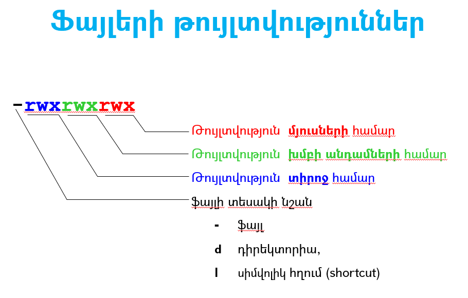

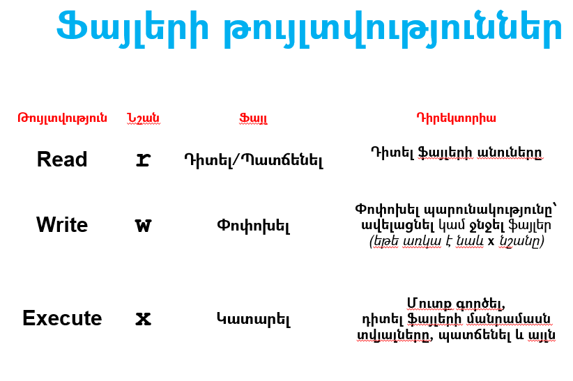

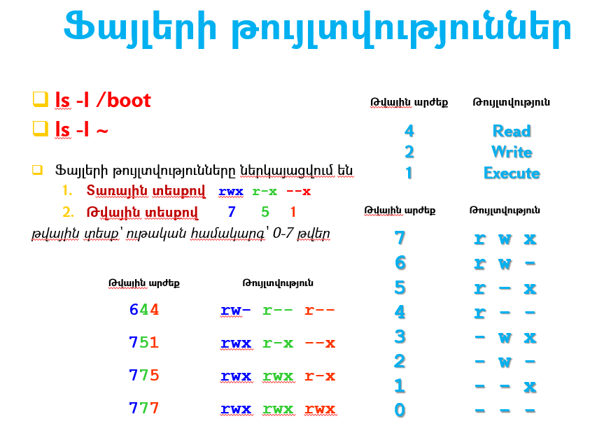

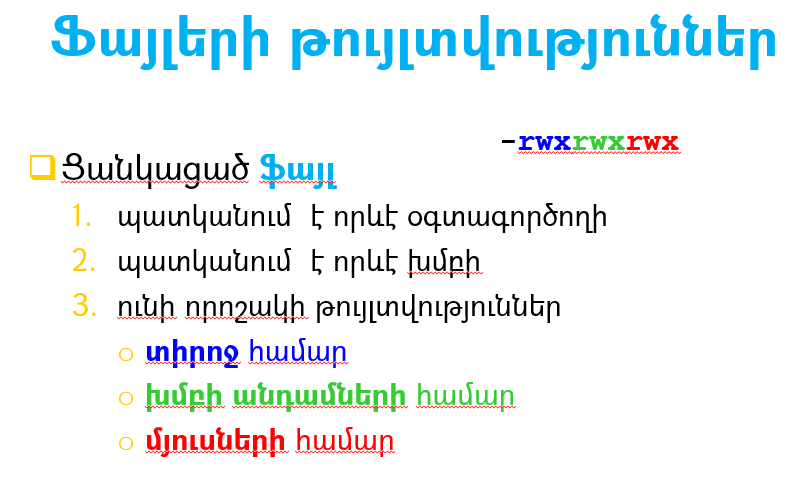

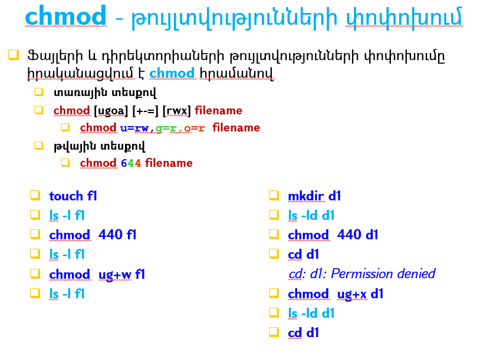

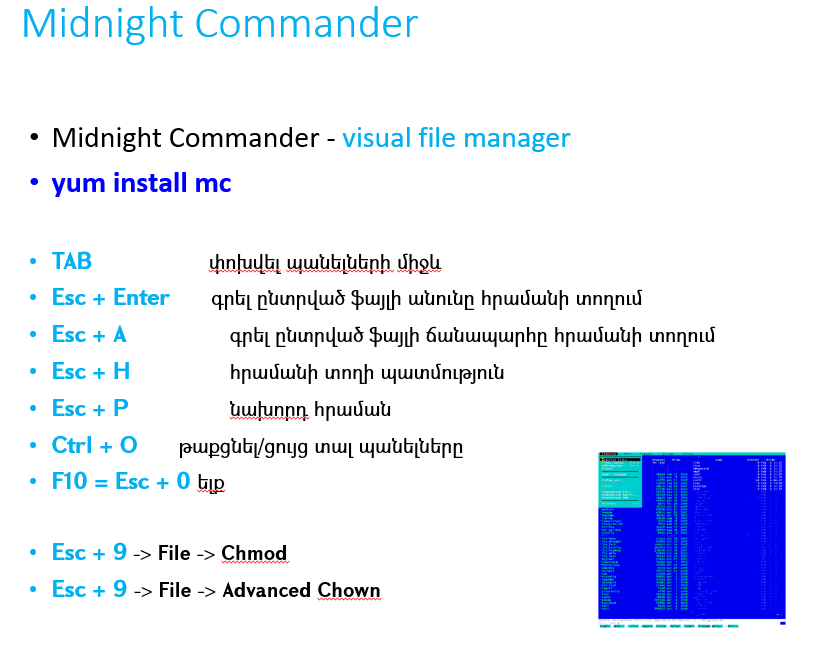

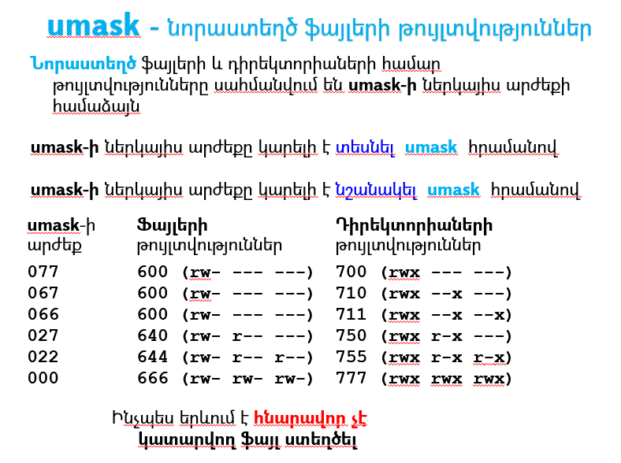

### I/O Redirection

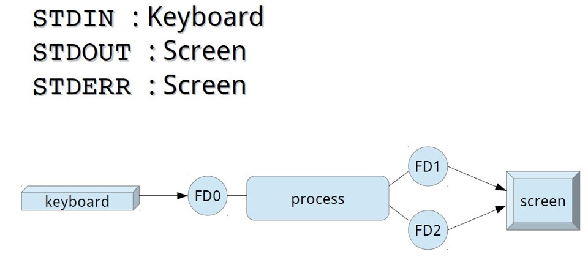

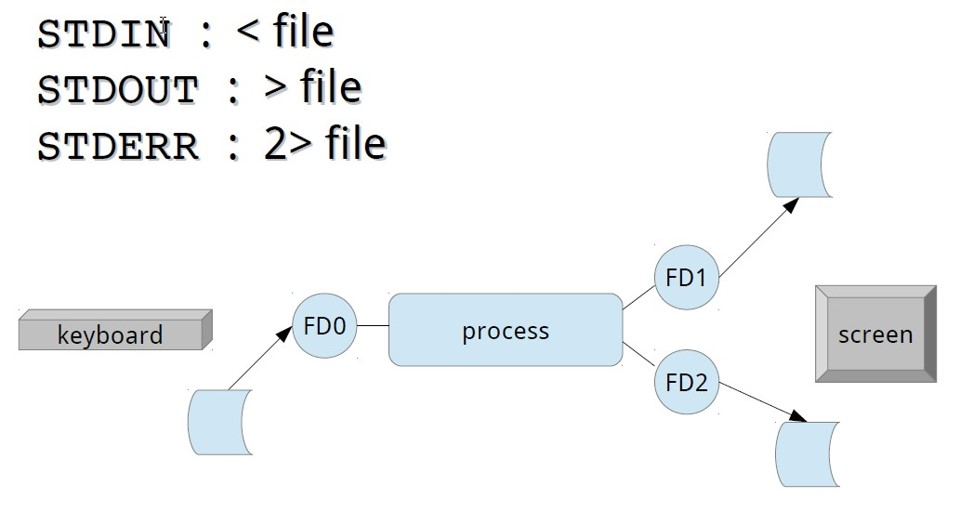

> STDOUT - Standard output  		>     >> 
 
* `ls /etc > ~/stdout`
* `ls /etc >> ~/stdout`

> STDERR - Standard error output		2>   2>> 
* `ls /e > ~/stdout`
* `ls /e > ~/stdout 2> ~/stderr`
* `ls /e > ~/stdout 2> /dev/null`

### Pipes

Pipeline - Մեկ հրամանի STDOUT-ը ուղարկել այլ հրամանի STDIN-ին

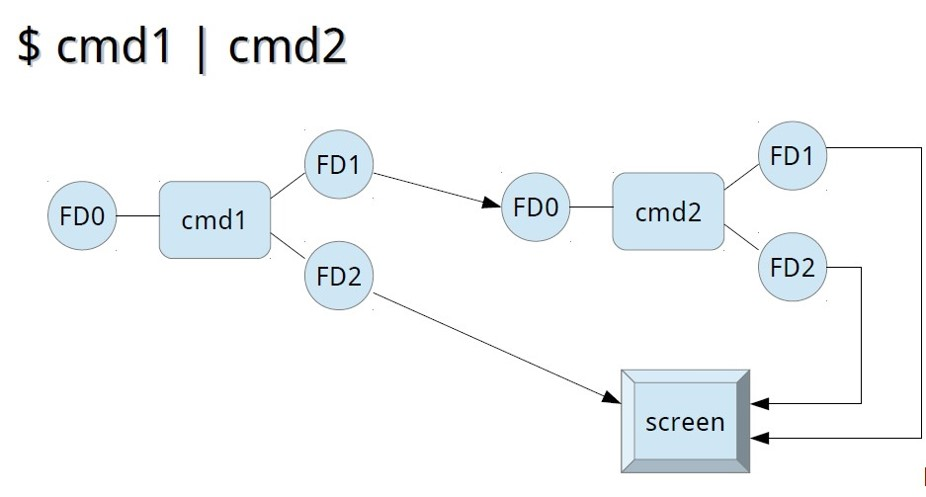

> Օրինակ

`ls /usr/bin | sort -r`

Նույնը չէ, ինչ հաջորդաբար կատարումը ;-ով

`ls /usr/bin ; sort –r `

> Հրամանների համակցում

Հրամանները կարելի է համակցել հետևյալ կերպ՝

* **&&**	Logical AND 
    եթե առաջին հրամանի ելքի կոդը (exit code) 0 է, կատարել երկրորդը

* **||**	Logical OR
    եթե առաջին հրամանի ելքի կոդը (exit code) 0 չէ, կատարել երկրորդը

* **;**	Պարզապես կատարել հրամանները՝ մեկը մյուսի հետևից

* **|**	Փոխանցել առաջին հրամանի ելքի տվյալները (stdout) 
    երկրորդ հրամանի մուտքին (stdin)

_( **echo $?**  - ցույց է տալիս վերջին հրամանի ելքի կոդը (exit code) 0=OK)_

  
### Access files

There are several tool to view text files contents.

> **less** - view/browse text file page-by-page

* **Enter/DOWNARROW**	– մեկ տող ներքև
* **SPACE/PgDn**		– մեկ էկրան ներքև
* **PgUp/b**			– մեկ էկրան վերև
* **UPARROW**			– մեկ տող վերև
* **/**					– որոնում
* **Home**				– անցնել տեքստի սկիզբը
* **End**				– անցնել տեքստի վերջը
* **q**					– ելք

> Օրինակներ
 
`less /etc/services`
`ls /usr/bin | sort -r | less`

  

> **cat** - output whole file to terminal

> Օրինակներ
 
`cat /etc/services`

`cat /etc/services | sort -r `

`cat /etc/services | sort -r | less`

  

> **head** - output some first lines (default 10) of file to terminal

> Օրինակներ
 
`head /etc/services`

`head -1 /etc/services`

`head -1 /etc/services > /tmp/h1`

`head -1 /etc/services >> /tmp/h1`
 
  

> **tail** - output some last lines (default 10) of file to terminal

> Օրինակներ
 
`tail /etc/services`

`tail -1 /etc/services`

`tail -1 /etc/services > /tmp/s1`

`tail -1 /etc/services >> /tmp/s1`

  

> **grep** - filter lines based on pattern

> Օրինակներ
 
`cat /etc/services | grep http `

`ls /usr/bin | grep log`

`ls /usr/bin | grep ^log`

`ls /usr/bin | grep log$`

  
### Text Editors (Խմբագիրներ)

* **vi /vim**	Standard UNIX editor
* **nano**		Simple display-oriented text editor 
* **mcedit** 	Midnight Commander internal editor
* **joe** 		Joe editor
* **gedit/kate** 	Graphical editors 

#### Vim/Vi basics

Vim/Vi is a very powerful editor Linux/Unix text editor. The reason to know it's basics is that it is initially available almost on any Linux/UNIX system.
Even if any other editor will not be present or available to install Vi/Vim will be there to enable you editing text files.
(to learn more than below basics you can type `vimtutor` and follow instructions)

> Vim Modes
* **Insert**	- Insert text by typing
* **Execute**	- Execute commands within the editor
* **Command**	- Perform different editing actions using single keystrokes
* **Visual**	- Highlight or select text for copying, deleting, etc

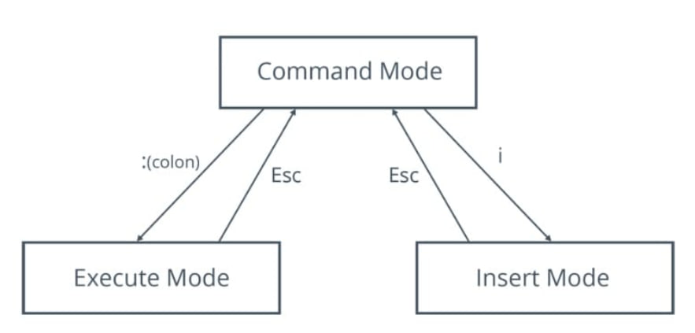

> Execute Mode Commands

* **:q**	- Quit when no changes have been made after last save
* **:q!**	- Quit ignoring changes made
* **:wq**	- Save current file and quit
* **:w {file name}** - Save file with specified name

### Sourcing Scripts
### Variables
### Positional Parameters
### Error handling, Exit Status
### Conditionals
### Loops
### Functions
### Arrays
### Text Processing Tools

